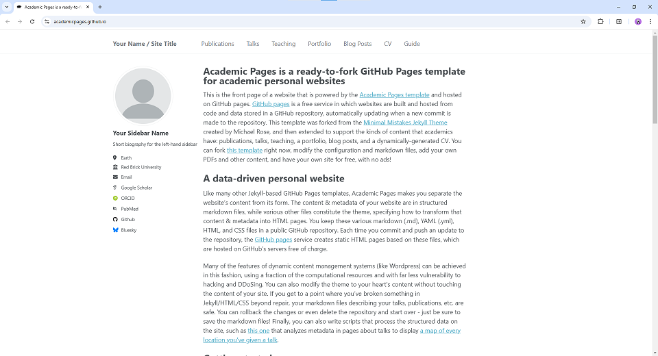
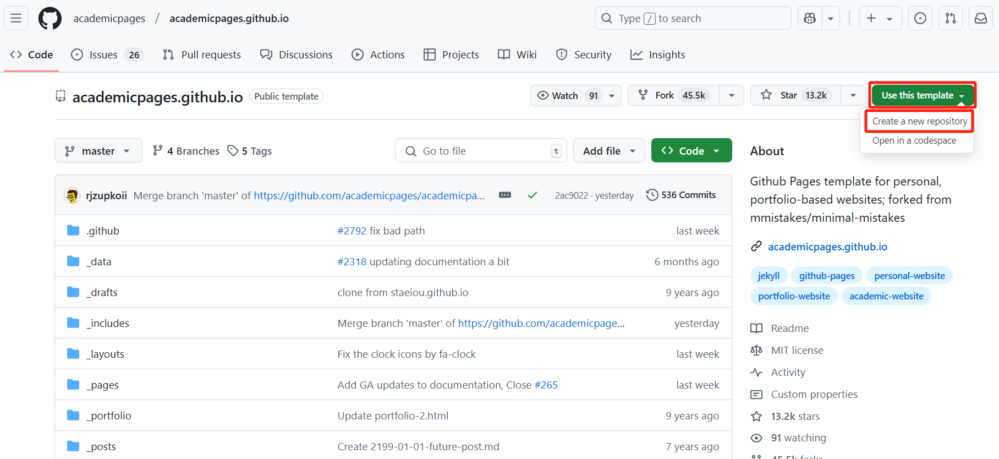
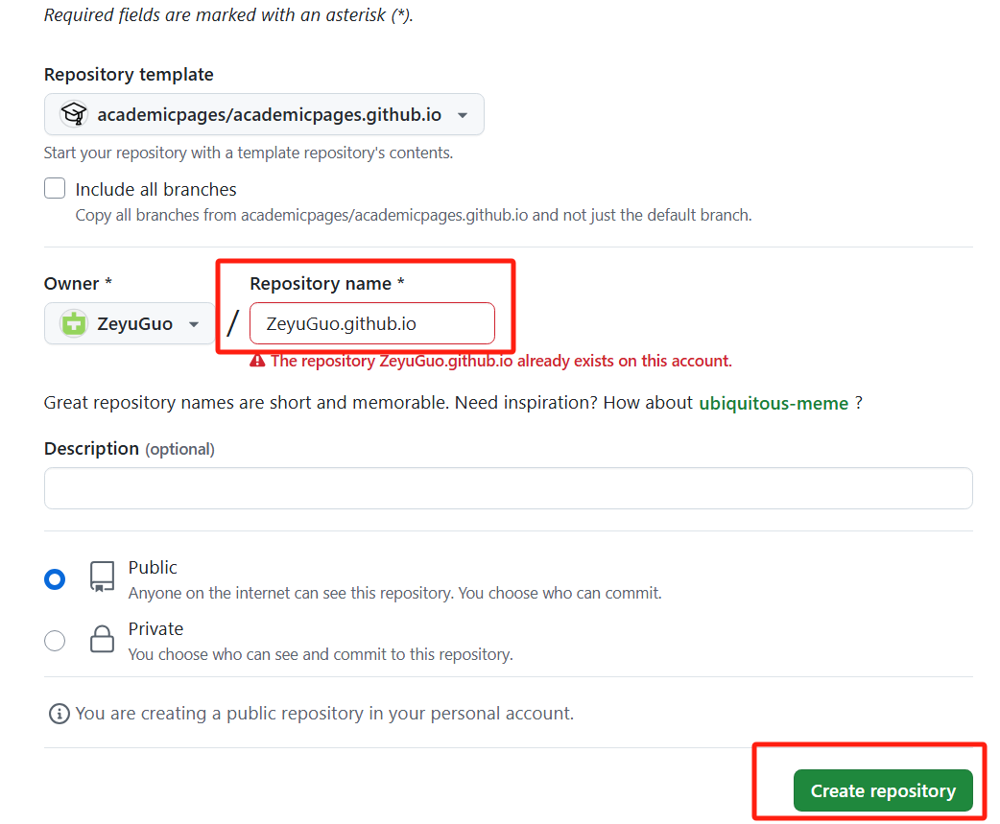
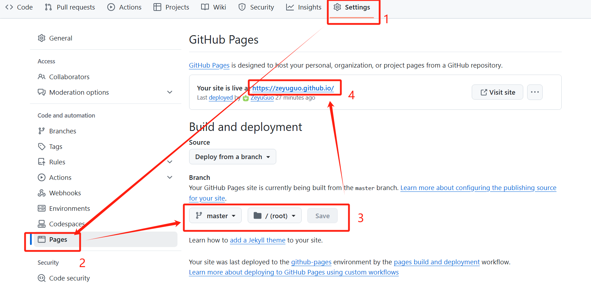
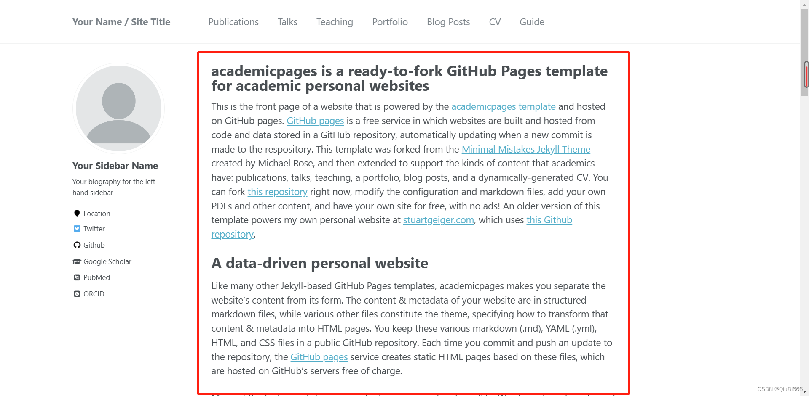
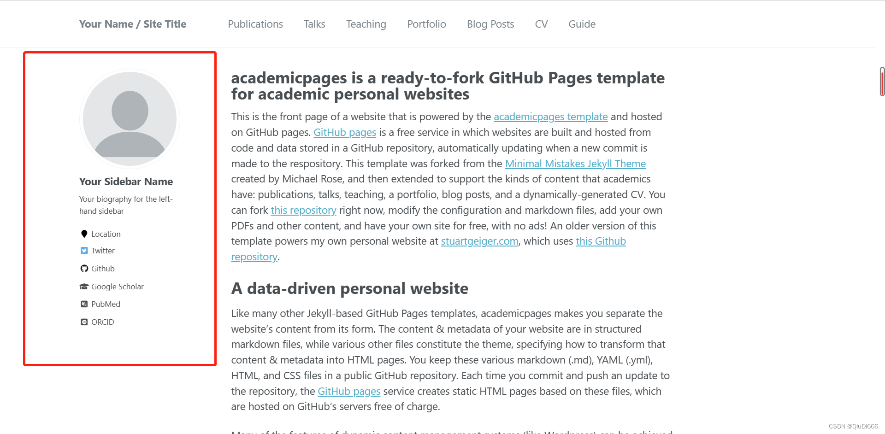
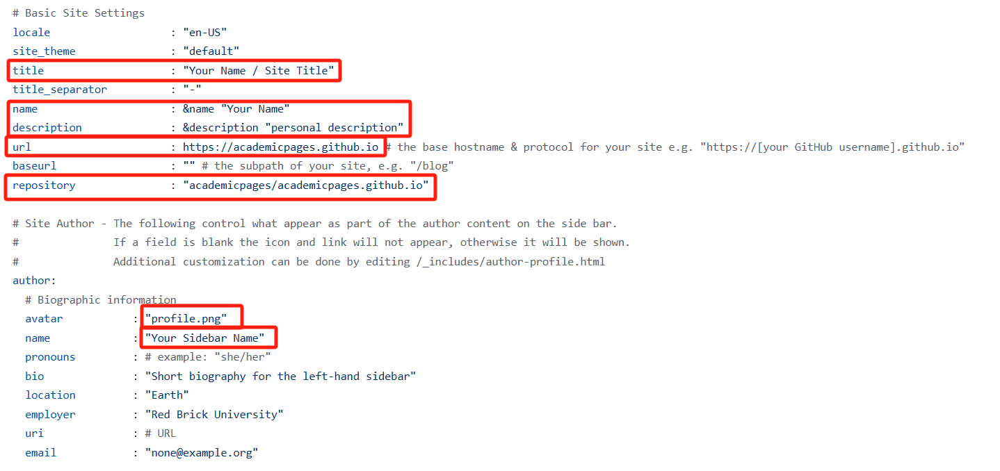

Personal website is a great way to let others know you better. This blog is about how to build a clear academic personal website. Like this:



# Getting Started

1. First, you should register a GitHub account.

2. Find a template, for example: [academicpages.github.io](https://github.com/academicpages/academicpages.github.io)

3. Click the "Use this template" button in the top right. And then click "Create a new repository".



4. On the "New repository" page, enter your repository name as "[your GitHub username].github.io", which will also be your website's URL.



5. Open the repository and click the "Settings", make sure the branch is set to "root". And then you will see your website link is available.



6. Then you could click the website link and change the content based on your information.

# Change content

1. To change this part, you should revise `yourname.github.io/_pages/about.md`. 



Here is an example:

```
I'm a third year undergraduate student from [School of EECS](https://eecs.pku.edu.cn/), [Peking University](https://www.pku.edu.cn/). My research interest includes computer vision, computer graphics, machine learning, and computational photography.

I am very fortunate to be advised by [Prof. XXX](https://www.XXX.com/) of XXX Lab from [School of Computer Science](https://cs.pku.edu.cn/), Peking University. I was advised by [Prof. XX](https://XXX.pku.edu.cn/) from [School of Computer Science](https://cs.pku.edu.cn/), Peking University.

You can find my CV here: [XX's Curriculum Vitae](../assets/Curriculum_Vitae.pdf).
```

2. To add your CV, you should upload your `Curriculum_Vitae.pdf` file to `yourname.github.io/assets/Curriculum_Vitae.pdf`

3. To change the sidebar, you should revise `yourname.github.io/_config.yml`.



Change these contents based on your information. Note: the picture should be **"xx.png" format**. And you should upload your picture to `yourname.github.io/images` folder.



If you don't need some functions, you can comment them.

4. To change the navigation bar, you should revise `yourname.github.io/_data/navigation.yml` file based on your needs.

5. If you want to change the layout or structure of the page, you should learn some knowledge about `html` and revise the code of the page you want to change.

Having fun on your personal website!
